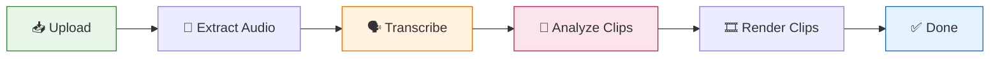

<p align="center">
  
</p>

<h1 align="center">DigiClip</h1>

<p align="center">
  <strong>Drop a video → Get TikTok-ready clips. Instantly.</strong><br />
  Offline-first desktop app that transcribes long-form video, finds viral moments with AI, and renders captioned 9:16 vertical clips — no cloud render farm required.
</p>

<p align="center">
  <a href="https://github.com/n1ssyyy/DigiClip/actions/workflows/ci.yml">
    
  </a>
  <a href="https://github.com/n1ssyyy/DigiClip/releases/latest">
    
  </a>
  <a href="https://github.com/n1ssyyy/DigiClip/blob/main/LICENSE">
    
  </a>
  
  
  
  
  
  
  
  
  
</p>

<p align="center">
  <a href="https://github.com/n1ssyyy"></a>
  <a href="https://shkolladigjitale.com/"></a>
</p>

---

## ✨ Why DigiClip?

| Feature | Description |
|---------|-------------|
| 🎬 **Drag & Drop** | `.mp4`, `.mov`, `.mkv`, `.webm`, `.m4a` up to 500 MB |
| 🧠 **AI Clip Scoring** | OpenRouter LLM (BYOK) finds viral hooks — offline heuristic fallback |
| 🎤 **Offline Transcription** | whisper.cpp (`tiny.en` → `large-v3`), word-level timestamps, no API costs |
| 📱 **Vertical Renders** | 1080×1920 H.264 + faststart, loudness-normalized, HW encoder auto-pick |
| 🎨 **8 Caption Presets** | `tiktok`, `karaoke`, `hormozi`, `minimal`, `beast`, `neon`, `highlight`, `ghost` |
| ⚡ **Live Progress** | Real-time pipeline via Laravel Reverb websockets (no refresh needed) |
| 🔁 **Resilient Queue** | Pause, resume, retry, cancel — dedicated media worker (1 GB / 30 min) |
| 🖥 **Native Desktop** | NativePHP + Electron, frameless dark UI, auto-starts workers + Reverb |
| 🔒 **Private by Default** | All data stays local (SQLite + `storage/`); only scoring optionally calls OpenRouter |

---

## 🧭 Pipeline



1. **Upload** — `POST /projects` chains `ExtractAudio → Transcribe → AnalyzeClips`
2. **ExtractAudioJob** — 16 kHz mono WAV + poster frame via ffmpeg
3. **TranscribeJob** — whisper.cpp with word timings (token-level when available)
4. **AnalyzeClipsJob** — OpenRouter ranks 15–90s candidates (default 3) or `HeuristicScorer`
5. **RenderClipJob** — 1080×1920 MP4 with burned captions + progress events on `project.{id}`

---

## 🛠 Tech Stack

| Layer | Technology |
|-------|------------|
| **Framework** | Laravel 13, Inertia.js, React 19, Tailwind 4, shadcn/ui |
| **Desktop** | NativePHP Desktop v2 (Electron), auto Reverb + queue workers |
| **Realtime** | Laravel Reverb (localhost) + Laravel Echo / pusher-js |
| **Speech-to-Text** | whisper.cpp sidecar via `BinaryManager` + `ModelManager` |
| **Clip Intelligence** | OpenRouter (BYOK) + offline `HeuristicScorer` fallback |
| **Video Render** | ffmpeg + libass (captions) + loudnorm (audio) |
| **Data** | SQLite, database queues (`default` + `media`), local disk |

---

## 🚀 Quick Start

### Prerequisites
- **PHP 8.3** with `ctype curl dom fileinfo mbstring openssl pdo pdo_sqlite tokenizer xml zip iconv`
- **Composer 2**, **Node 22** + npm
- **ffmpeg** + **ffprobe** on `PATH` (or bundled in `resources/bin/<platform>/`)
- **whisper.cpp** `whisper-cli` + `ggml-*.bin` model (downloads on first use)

### Web Development

```bash
composer install
npm install
cp .env.example .env
php artisan key:generate
php artisan migrate

# Terminal 1
npm run dev

# Terminal 2
php artisan serve

# Terminal 3
php artisan reverb:start --host=127.0.0.1 --port=8080
```

Open **http://127.0.0.1:8000** → Drop a video. Health probe at `/health`.

### Desktop Development

```bash
php artisan native:run -n
```

### Production Builds

```bash
php artisan native:build linux   # AppImage + .deb
php artisan native:build win     # NSIS installer (wine for cross-compile)
```

> **Note:** After `composer install/update`, run the plugin workaround:
> ```bash
> npm ci --prefix nativephp/electron
> npm run plugin:build --prefix nativephp/electron
> ```

---

## ⚙️ Configuration

| Key | Default | Purpose |
|-----|---------|---------|
| `OPENROUTER_API_KEY` | — | BYOK for LLM scoring (unset = heuristic fallback) |
| `OPENROUTER_MODEL` | `nvidia/nemotron-3-ultra-550b-a55b:free` | Scoring model (override per-project in Settings) |
| `OPENROUTER_TOKEN_CAP` / `OPENROUTER_TIMEOUT_S` | `120000` / `90` | Prompt budget + HTTP timeout |
| `DIGICLIP_STT_MODEL` | `base.en` | `tiny.en`, `base.en`, `large-v3-turbo(-q5_0)`, `large-v3` |
| `DIGICLIP_UPLOAD_MAX_MB` | `500` | Upload limit (desktop allows 512 MB) |
| `NATIVEPHP_APP_VERSION` | `1.0.0` | **Bump every release** — drives updater + installer names |
| `REVERB_*` / `VITE_REVERB_*` | `localhost:8080` | Realtime sockets (auto-started in packaged app) |

In-app **Settings** page controls OpenRouter key/model, STT model, clip count, and caption style.

---

## 📦 Media Binaries & Models

`App\Services\Stt\BinaryManager` resolves binaries in order:
1. `resources/bin/<platform>/` (bundled, ships with app)
2. System `PATH`

| Platform | ffmpeg | ffprobe | whisper-cli |
|----------|--------|---------|-------------|
| Linux | ✅ Bundled | ✅ Bundled | ✅ Bundled |
| macOS | 🔄 PATH fallback | 🔄 PATH fallback | 🔄 PATH fallback |
| Windows | 🔄 PATH fallback | 🔄 PATH fallback | 🔄 PATH fallback |

Caption fonts (Archivo Black, Anton, Inter, JetBrains Mono) bundled in `resources/fonts/`.

Whisper models (75 MB – 3 GB) download on first use. To pre-seed:

```bash
php artisan digiclip:provision-media          # default model only
php artisan digiclip:provision-media --all    # all known models
```

Check `/api/health` for resolved binary/model status.

---

## 🧪 Tests & Quality

```bash
php artisan test        # feature + unit (skips gracefully without binaries)
npm run build           # production assets → public/build
vendor/bin/pint         # code style (Laravel Pint)
```

---

## 🤖 CI / CD

| Job | Runner | Artifacts |
|-----|--------|-----------|
| `test` | `ubuntu-latest` | composer + npm, build, test, Pint |
| `build-linux` | `ubuntu-latest` | AppImage + .deb |
| `build-windows` | `windows-latest` | NSIS `.exe` |
| `release` | `ubuntu-latest` | On `v*` tags: attaches both platform installers |

```bash
# Cut a release (bump version first in config/nativephp.php or NATIVEPHP_APP_VERSION)
git tag v1.1.0 && git push origin v1.1.0
```

---

## 🗺 Project Structure

```
routes/web.php              / Home · /health · /api/health · POST /projects · renders · settings
app/Http/Controllers/       Project · Transcript · Render · Settings · Health · Window · Link
app/Jobs/                   ExtractAudio · Transcribe · AnalyzeClips · RenderClip
app/Services/Stt/           WhisperCppTranscriber · ModelManager · BinaryManager
app/Services/Clips/         OpenRouterClient · ClipPrompt · HeuristicScorer · ClipValidator
app/Services/Render/        RenderService (9:16 + libass + loudnorm + progress)
app/Services/Captions/      AssBuilder (8 presets) · SrtBuilder
app/Services/Media/         FfmpegService (extract / poster / probe)
app/Services/System/        HealthProbe (/health + /api/health)
config/digiclip.php         upload · OpenRouter · STT models · clip bounds
resources/js/pages/         Home (dropzone + pipeline + clips) · Health · Settings
```

---

## 🩺 Troubleshooting

| Symptom | Fix |
|---------|-----|
| All routes 500 after `artisan serve` | Missing `iconv`/`mbstring` in serving PHP — check `/api/health` |
| `whisper-cli` / `ffmpeg not found` | Check `/health`; add binary to `resources/bin/<platform>/` or `PATH` |
| Jobs stuck in queue | Ensure `QUEUE_CONNECTION=database`; run `php artisan queue:work` (desktop auto-starts) |
| Electron: "No entry file found" | Stale `electron-plugin/dist/` — run `npm run plugin:build --prefix nativephp/electron` |
| `/_native/api/* 403` | Expected: `PreventRegularBrowserAccess` gate (app webview only) |

---

## 🗺 Roadmap

- [ ] **Speaker autofocus** — face-tracked 9:16 crop following active speaker
- [ ] Chunked/resumable uploads for 2 GB+ sources
- [ ] Two-person / letterbox framing presets
- [ ] Signed releases + auto-update channel

---

## 🤝 Contributing

PRs welcome! Fork → branch → `php artisan test` green → PR against `main`. CI must pass on Linux & Windows.

---

## 📄 License

**MIT** — see `composer.json`. Your videos stay yours and stay local.

---

## 🙏 Acknowledgements

Built by **[n1ssyyy](https://github.com/n1ssyyy)** in collaboration with **[Shkolla Digjitale](https://shkolladigjitale.com/)** (Prizren).  
Reviewed by **Kebir Çesko** and **Arianit Tërshnjaku**.

Powered by: **Laravel** · **NativePHP** · **Inertia.js** · **whisper.cpp** · **ffmpeg** · **OpenRouter** · **Reverb** · **Tailwind CSS** · **React** · **shadcn/ui**