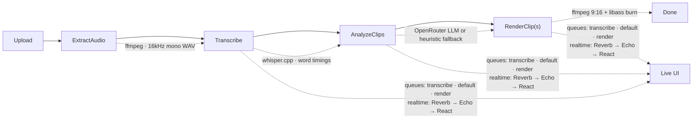

<p align="center">
  
</p>

<h1 align="center">DigiClip</h1>

<p align="center">
  <strong>Drop a video, get TikTok-ready clips.</strong><br />
  Offline-first desktop app that transcribes long-form video, finds the moments worth posting,
  and renders captioned 9:16 clips — no cloud render farm required.
</p>

<p align="center">
  <a href="https://github.com/n1ssyyy/DigiClip/actions/workflows/ci.yml">
    
  </a>
  <a href="https://github.com/n1ssyyy/DigiClip/releases/latest">
    
  </a>
  <a href="https://github.com/n1ssyyy/DigiClip/blob/main/LICENSE">
    
  </a>
  
  
  
  
  
  
  
  
  
</p>

<p align="center">
  <a href="https://github.com/n1ssyyy"></a>
  <a href="https://shkolladigjitale.com/">
    
  </a>
</p>

---

## ✨ Features

- **Drag-and-drop ingest** — `.mp4`, `.mov`, `.mkv`, `.webm`, `.m4a` up to 500 MB (configurable).
- **Offline transcription** — [whisper.cpp](https://github.com/ggerganov/whisper.cpp) sidecar (`tiny.en` → `large-v3`) with word-level timestamps. No Python, no torch, no API bill for STT.
- **Smart clip picking** — bring-your-own-key [OpenRouter](https://openrouter.ai) LLM scores viral moments (hook, payoff, self-containment), with an offline heuristic fallback when no key is set.
- **Vertical renders** — 1080×1920 H.264 + faststart, center-crop 9:16, loudness-normalized mobile audio (`loudnorm`), hardware encoder auto-pick (VideoToolbox / NVENC / libx264).
- **8 caption presets** — `tiktok`, `karaoke`, `hormozi`, `minimal`, `beast`, `neon`, `highlight`, `ghost`, burned in via libass (plus downloadable `.srt`).
- **Live UI, no refresh buttons** — project status and render progress stream over Laravel Reverb websockets (autostarted inside the desktop app).
- **Queue-resilient pipeline** — pause, resume, retry, cancel; failed jobs report inline. Media jobs run on a dedicated queue worker (1 GB / 30 min).
- **Desktop-native** — [NativePHP Desktop v2](https://nativephp.com) (Electron shell, frameless dark-first UI, system health probe at `/health`).
- **Private by default** — video, transcripts and renders stay in local SQLite + `storage/`; only clip *scoring* optionally calls OpenRouter.

## 🧭 How it works



1. **Upload** (`POST /projects`) stores the source and chains `ExtractAudio → Transcribe → AnalyzeClips`.
2. **ExtractAudioJob** pulls 16 kHz mono WAV + a poster frame via `FfmpegService`.
3. **TranscribeJob** runs `WhisperCppTranscriber` (token timings when the binary provides them, even-split fallback otherwise) and stores words/segments/confidence.
4. **AnalyzeClipsJob** asks OpenRouter for ranked candidates (15–90 s, default 3 clips) or falls back to `HeuristicScorer`; `ClipValidator` clamps ranges and styles.
5. **RenderClipJob** cuts each candidate to captioned 1080×1920 MP4 with progress events (`render.progress`) on `project.{id}`.

## 🛠 Tech stack

| Layer      | Choice |
|------------|--------|
| App        | Laravel 13, Inertia.js + React 19, Tailwind 4, shadcn/ui (neutral, dark-first) |
| Desktop    | NativePHP Desktop v2 (Electron), auto-started Reverb + queue workers |
| Realtime   | Laravel Reverb (localhost) + Laravel Echo / pusher-js |
| STT        | whisper.cpp sidecar via `BinaryManager` + `ModelManager` |
| Clip AI    | OpenRouter (BYOK, default `nvidia/nemotron-3-ultra-550b-a55b:free`) with offline heuristic fallback |
| Render     | ffmpeg (bundled or system) + libass captions, loudnorm audio |
| Data       | SQLite, database queue (`default` + `media`), local disk storage |

## 🚀 Getting started

### Prerequisites

- PHP **8.3** with `ctype curl dom fileinfo mbstring openssl pdo pdo_sqlite tokenizer xml zip` (+ `iconv`)
- Composer 2, Node **22** + npm
- ffmpeg + ffprobe on `PATH` **or** bundled under `resources/bin/<platform>/` (see [Media binaries](#-media-binaries))
- whisper.cpp `whisper-cli` binary + a `ggml-*.bin` model for real transcription (tests skip gracefully without them)

### Web dev loop

```bash
composer install
npm install
cp .env.example .env
php artisan key:generate
php artisan migrate

npm run dev                            # vite (terminal 1)
php artisan serve                      # Laravel (terminal 2)
php artisan reverb:start --host=127.0.0.1 --port=8080   # sockets (terminal 3)
```

Open http://127.0.0.1:8000 → drop a video. `/health` shows the system probe.

### Desktop dev loop

```bash
php artisan native:run -n              # Electron + queue workers + hot reload
```

### Production builds

```bash
php artisan native:build linux         # AppImage + deb
php artisan native:build win           # NSIS installer (wine needed when cross-compiling from Linux)
```

The Electron shell project is published into `nativephp/electron/` (custom
`electron-builder.mjs`: app icon, `.desktop` entry with matching
`StartupWMClass`, deb metadata). After `composer install/update`, refresh its
deps once — `native:build` / `native:run` run `npm ci` there themselves:

```bash
npm ci --prefix nativephp/electron
npm run plugin:build --prefix nativephp/electron   # stale-dist workaround, see below
```

> **Known upstream wrinkle** (nativephp/desktop 2.3.0): the shipped `electron-plugin/dist/` can be stale and fail the Electron main build. Workaround after every `composer install/update`:
> ```bash
> npm run plugin:build --prefix nativephp/electron
> ```
> CI does this automatically.

## ⚙️ Configuration

| Key | Default | What it does |
|-----|---------|--------------|
| `OPENROUTER_API_KEY` | — | BYOK key for LLM clip scoring. Unset → offline heuristic scorer. |
| `OPENROUTER_MODEL` | `nvidia/nemotron-3-ultra-550b-a55b:free` | Scoring model (override per-project in Settings). |
| `OPENROUTER_TOKEN_CAP` / `OPENROUTER_TIMEOUT_S` | `120000` / `90` | Prompt budget guard + HTTP timeout. |
| `DIGICLIP_STT_MODEL` | `base.en` | `tiny.en`, `base.en`, `large-v3-turbo(-q5_0)`, `large-v3`. |
| `DIGICLIP_UPLOAD_MAX_MB` | `500` | Upload cap (desktop `php.ini` allows 512 MB). |
| `NATIVEPHP_APP_VERSION` | `1.0.0` | **Bump every release** — drives updater + installer filenames. |
| Reverb `REVERB_*` / `VITE_REVERB_*` | localhost:8080 | Realtime socket; packaged app autostarts it. |

In-app **Settings** page additionally controls OpenRouter key/model, STT model, clip count and default caption style.

## 📦 Media binaries & models

`App\Services\Stt\BinaryManager` resolves each binary in order:

1. `resources/bin/<platform>/` (checked in, ships with the app — see `resources/bin/README.md`)
2. System `PATH`

Linux ships `ffmpeg`, `ffprobe`, `whisper-cli` today; macOS/Windows dirs are
staged and fall back to `PATH` until binaries are dropped in. Caption fonts
(Archivo Black, Anton, Inter, JetBrains Mono) are bundled in `resources/fonts/`.

Whisper models (`ggml-*.bin`, 75 MB–3 GB) are **not** bundled — they download
themselves on first transcribe (Settings shows an "on disk" badge per model).
To pre-seed (packaging, offline machines, CI):

```bash
php artisan digiclip:provision-media          # default model only
php artisan digiclip:provision-media --all    # every known model
```

`/api/health` reports exactly what's resolved — check there first when a job fails.

## 🧪 Tests & code style

```bash
php artisan test        # feature + unit (media tests skip cleanly without binaries/fixtures)
npm run build           # production assets → public/build
```

## 🤖 CI / CD

`.github/workflows/ci.yml` runs on pushes to `main`, PRs and tags:

| Job | Runner | Does |
|-----|--------|------|
| `test` | `ubuntu-latest` | composer + npm install, `npm run build`, `php artisan test`, Pint |
| `build-linux` | `ubuntu-latest` | Electron system deps, plugin workaround, `native:build linux` → AppImage + deb artifacts |
| `build-windows` | `windows-latest` | same via native toolchain, `native:build win` → NSIS `.exe` artifact |
| `release` | `ubuntu-latest` | on `v*` tags only: attaches both platforms' installers to the GitHub Release |

Cut a release:

```bash
# bump config/nativephp.php 'version' (or NATIVEPHP_APP_VERSION), then:
git tag v1.1.0 && git push origin v1.1.0
```

Unsigned builds are the default and install fine for personal/team distribution; for public auto-update + SmartScreen/Gatekeeper trust, add signing secrets (see [NativePHP code signing](https://nativephp.com/docs/desktop/2/publishing/building)) and extend the workflow env.

## 🗺 Project map

```
routes/web.php            / Home · /health · /api/health · POST /projects · renders · settings
app/Http/Controllers/     Project · Transcript · Render · Settings · Health · Window · Link
app/Jobs/                 ExtractAudio · Transcribe · AnalyzeClips · RenderClip
app/Services/Stt/         WhisperCppTranscriber · ModelManager · BinaryManager
app/Services/Clips/       OpenRouterClient · ClipPrompt · HeuristicScorer · ClipValidator
app/Services/Render/      RenderService (9:16 + libass + loudnorm + progress)
app/Services/Captions/    AssBuilder (8 presets) · SrtBuilder
app/Services/Media/       FfmpegService (extract / poster / probe)
app/Services/System/      HealthProbe (/health + /api/health)
config/digiclip.php       upload · OpenRouter pricing/caps · STT models · clip bounds
resources/js/pages/       Home (dropzone + pipeline + clips) · Health · Settings
```

## 🩺 Troubleshooting

| Symptom | Fix |
|---------|-----|
| Every route 500s after `artisan serve` | Child `php -S` lost extensions — ensure `iconv`/mbstring load in the serving PHP (`/api/health` lists them). |
| `whisper-cli` / `ffmpeg not found` | Check `/health`; add binary to `resources/bin/<platform>/` or `PATH`. |
| Transcribe/render jobs stuck | `QUEUE_CONNECTION=database`; in dev run a worker (`php artisan queue:work`), desktop autostarts them. |
| Electron build: "No electron app entry file found" | Stale `electron-plugin/dist/` — run the `plugin:build` workaround above. |
| `/_native/api/* 403` in logs | Expected: `PreventRegularBrowserAccess` gate, only the app webview may call them. |

## 🗺 Roadmap

- [ ] **Speaker autofocus** — face-tracked 9:16 crop that follows whoever is talking (track planner feeding a dynamic `crop` expression into `RenderService`; mouth-motion heuristic first, neural ASD later).
- [ ] Chunked/resumable uploads for 2 GB+ sources.
- [ ] Two-person / letterbox framing presets.
- [ ] Signed releases + auto-update channel.

## 🤝 Contributing

PRs welcome: fork, branch, `php artisan test` green, open a PR against `main`. CI must stay green on Linux and Windows.

## 📄 License

MIT — see `composer.json`. Video you process stays yours and stays local.

## 🙏 Acknowledgements

Developed by [n1ssyyy](https://github.com/n1ssyyy) in collaboration with
[Shkolla Digjitale](https://shkolladigjitale.com/) (Prizren).
Reviewed by Kebir Çesko and Arianit Tërshnjaku.

Built on Laravel · NativePHP · Inertia.js · whisper.cpp · ffmpeg · OpenRouter · Reverb · Tailwind CSS.